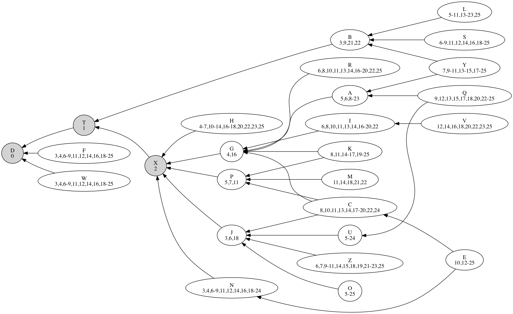

# Listener Puzzles

This is a small set of workings and jottings for solving some of the [The Listener Crossword](http://www.listenercrossword.com/) 
numerical puzzles.

Quite often there are problems of elimination and other constraints to apply to solutions, and the interesting part is
in working out what the constraints are.  Thereafter applying the constraints and eliminating values can be a bit error
prone and take up quite a bit of time in Microsoft Excel, so to further automate I often reach to a bit of scripting.  

Then I only have to worry about coding errors of course!

## Puzzle 4425

Puzzle here: [PDF](Times Listener 4425.pdf) and here: [crosswordclub.co.uk](https://www.crosswordclub.co.uk/puzzle/crossword/b6649b05551555540157bd58dcaf0195/play_ni)


After looking over this, one can see an interesting graph problem , in the form of a set of transitive relationships 
which it worth visualising, i.e. what unsolved letter is less than what other unsolved letter.

e.g. _9 Across_ `C G X D` and _11 Across_ `P X X D` imply C > G > X > D and P > X > D, giving a graph of

```
D -<- X -<- G -<- C
      | -<- P

```

The program provided reads through the clues and spits out a **GraphViz** formatted file of the relationships between
the unsolved variables.

By applying constraints to upper and lower bounds, as well as constraints that are implicit in each clue, further 
elimination of possible values for each unsolved letter are possible and are visualised.

### Requirements

- Python3
- [Graphviz](http://graphviz.org/)
- `pip3 install -r requirements.txt`

 

Generate the GraphViz document like so, using the `dot` command from the GraphViz package.

```
./generate_graph.py > gen.gv
dot  -Tpng gen.gv > gen.png
```



### Method of Solving

Simultaneously, _off-screen_, placing values into the grid and one is able to further constrain the values, and fully 
solve the puzzle, by placing additional constraints in `exogenous_constraints.apply()` and rerunning the solver.

